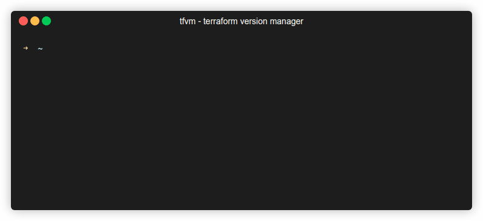
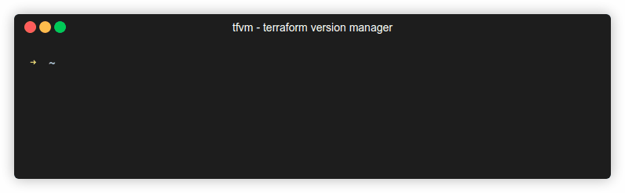
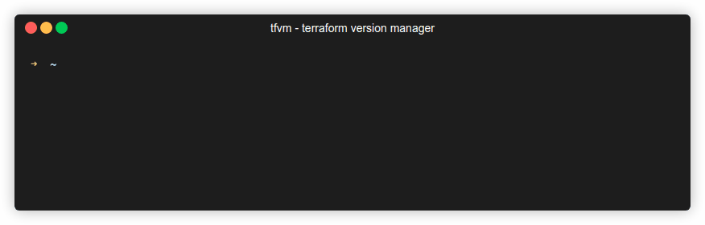
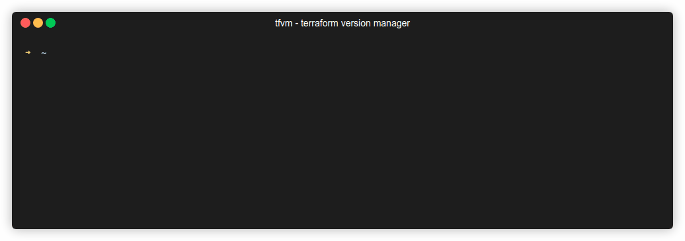
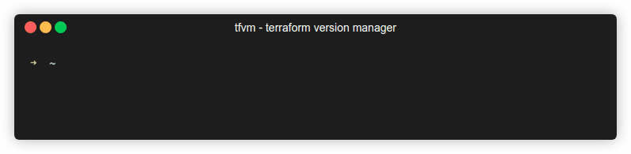

# Terraform Version Manager (TFVM)

### A modern, fast CLI tool to manage multiple Terraform versions on your system

[](https://www.npmjs.com/package/tfvm) [](https://www.npmjs.com/package/tfvm) [](https://www.npmjs.com/package/tfvm) [](https://nodejs.org) [](https://github.com/anindya-dey/tfvm/actions)

> **Never worry about Terraform version conflicts again!** 🚀  
> Seamlessly switch between Terraform versions for different projects, just like `nvm` for Node.js.

## 🎯 Why TFVM?

- 🏢 **Multiple Projects?** Different projects often require different Terraform versions
- 🔄 **Legacy Support?** Need to maintain older infrastructure with specific Terraform versions  
- 🆕 **Latest Features?** Want to try new Terraform features without breaking existing workflows
- 👥 **Team Consistency?** Ensure your entire team uses the same Terraform version
- 🛡️ **Risk Mitigation?** Test upgrades safely before applying to production

**TFVM solves all of this with simple, intuitive commands.**

## ✨ What's New in v2.0

- ⚡ **Faster & Lighter** - Reduced bundle size to ~9KB (98% smaller!)
- 🔄 **Auto-Update Check** - Get notified when new versions are available
- 🌐 **Modern APIs** - Built with Fetch API for Node.js 18+ compatibility
- 🧪 **Better Testing** - Comprehensive test suite with Bun test runner
- 📦 **Fewer Dependencies** - Streamlined to essential packages only
- 🚀 **Improved Performance** - Optimized async operations throughout

## 🚀 Quick Start

**Requirements:** Node.js >= 18.0.0

Install globally via npm:

```sh
npm install -g tfvm
```

Or with other package managers:
```sh
# Using yarn
yarn global add tfvm

# Using pnpm  
pnpm add -g tfvm

# Using bun
bun add -g tfvm
```


## 🎬 Quick Demo

```bash
# 1. Install a specific Terraform version
$ tfvm download 1.6.0

# 2. Switch to it  
$ tfvm use

# 3. Verify it's active
$ terraform version
Terraform v1.6.0

# 4. List all your versions
$ tfvm list
```

## ✨ Features

- 🔄 **Easy version switching** - Switch between Terraform versions with one command
- 📦 **Automatic downloads** - Download any Terraform version from HashiCorp's official releases
- 🎯 **Interactive prompts** - User-friendly selection menus and confirmations
- 🗂️ **Local management** - Keep multiple versions locally and switch as needed
- 🖥️ **Cross-platform** - Works on Windows, macOS, and Linux
- ⚡ **Fast & lightweight** - Optimized bundle size (~9KB) with minimal dependencies
- 🔧 **Configurable** - Customize storage directory via configuration files
- 🛡️ **Safe operations** - Confirmation prompts for destructive actions
- 🔍 **Version discovery** - Browse all available Terraform releases
- 📊 **Smart filtering** - Automatically handles platform-specific downloads
- 🔔 **Update notifications** - Get notified when new TFVM versions are available

## 🚀 Common Use Cases

<details>
<summary><b>🏗️ Project-specific Terraform versions</b></summary>

```bash
# For legacy project requiring Terraform 1.4.x
cd legacy-infrastructure
tfvm use  # Select 1.4.6

# For new project using latest features  
cd new-infrastructure
tfvm use  # Select 1.6.0
```
</details>

<details>
<summary><b>🔬 Testing Terraform upgrades</b></summary>

```bash
# Download the new version
tfvm download 1.6.0

# Test with new version
tfvm use  # Select 1.6.0
terraform plan

# Rollback if issues found
tfvm use  # Select your stable version
```
</details>

<details>
<summary><b>👥 Team synchronization</b></summary>

```bash
# Team lead shares the version
echo "Team is using Terraform 1.5.7"

# Everyone downloads the same version
tfvm download 1.5.7
tfvm use  # Select 1.5.7

# Verify consistency
terraform version
```
</details>

## 📋 Available Commands

### `tfvm list` | `tfvm ls` 

List locally downloaded Terraform versions or browse remote versions.

**Local versions:**
```sh
tfvm list    # Show all locally installed versions
tfvm ls      # Short alias
```


**Remote versions:**
```sh
tfvm list --remote    # Browse all available versions from HashiCorp
tfvm ls -r           # Short alias with flag
```


**No versions installed:**


---

### `tfvm download` | `tfvm d`

Download and install Terraform versions from HashiCorp's official releases.

**Interactive download:**
```sh
tfvm download    # Browse and select from all available versions
tfvm d          # Short alias
```



**Version-specific download:**
```sh
tfvm download 1.6.0    # Download specific version releases
tfvm d 1.6.0          # Short alias
```


---

### `tfvm remove` | `tfvm rm`

Remove installed Terraform versions from your system.

**Remove specific version:**
```sh
tfvm remove    # Select which version to remove
tfvm rm       # Short alias
```



**Remove all versions:**
```sh
tfvm remove --all    # Remove all installed versions
tfvm rm -a          # Short alias with flag
```



---

### `tfvm use`

Set a specific Terraform version as the default system version.

```sh
tfvm use    # Select from installed versions to set as default
```



> **💡 Note:** You may need to add the TFVM directory to your PATH environment variable. The `tfvm dir` command shows the exact path to add.

---

### `tfvm dir`

Display the directory where Terraform executables are stored.

```sh
tfvm dir    # Shows storage directory (default: ~/.tfvm)
```



## 🔧 Configuration

TFVM can be configured using RC files. Create a `.tfvmrc` file in your home directory:

```json
{
  "TERRAFORM_RELEASE_REPO": "https://releases.hashicorp.com/terraform",
  "STORAGE_DIR": "/custom/path/to/terraform/versions",
  "TFVM_PATH": "/custom/path/to/terraform/versions"
}
```

### Environment Variables

You can also use environment variables for configuration:

```bash
export TFVM_STORAGE_DIR="/opt/terraform-versions"
export TFVM_PATH="/opt/terraform-versions"
```

### Advanced Configuration

<details>
<summary><b>Custom Release Repository</b></summary>

```json
{
  "TERRAFORM_RELEASE_REPO": "https://your-custom-mirror.com/terraform"
}
```
</details>

<details>
<summary><b>Corporate Environment Setup</b></summary>

```bash
# Set custom paths for corporate environments
export TFVM_STORAGE_DIR="/shared/tools/terraform"
export TFVM_PATH="/shared/tools/terraform"

# Or create a system-wide config
sudo mkdir -p /etc/tfvm
echo '{"STORAGE_DIR": "/shared/tools/terraform"}' | sudo tee /etc/tfvm/config.json
```
</details>

## 🛠️ Development

This project is built with modern tools for optimal performance:

- **Runtime** - Node.js 18+ (for production) / Bun (for development)
- **TypeScript** - Type-safe development with ESNext features
- **Bun** - Fast bundling and testing
- **Modern APIs** - Fetch API for HTTP requests (Node.js 18+)
- **Modern Dependencies**:
  - `citty` - Modern lightweight CLI framework
  - `@clack/prompts` - Beautiful interactive prompts
  - `node-html-parser` - Fast HTML parsing
  - `fflate` - Fast ZIP compression
  - `chalk` v4 - Terminal string styling (CommonJS compatible)

### Building from source

```sh
# Clone the repository
git clone https://github.com/anindya-dey/tfvm.git
cd tfvm

# Install dependencies with Bun (recommended)
bun install

# Or use npm/pnpm/yarn
npm install

# Build the project (creates Node.js-compatible bundle)
bun run build

# Run tests
bun test

# Run tests with coverage
bun run test:coverage

# Type check
bun run lint

# Link for local development
npm link
```

### Tech Stack Details

**Development:**
- Built with Bun for fast development experience
- TypeScript with strict mode enabled
- ES modules in source code
- Comprehensive test suite using Bun's test runner
- CI/CD with GitHub Actions testing Node.js 18, 20, and 22

**Production:**
- Bundled to CommonJS for broad Node.js compatibility
- Minified output (~11KB)
- Node.js 18+ required (uses native Fetch API)
- Zero TypeScript runtime dependencies
- Modern, lightweight dependencies

## 📁 Storage Structure

TFVM organizes Terraform versions in your home directory:

```
~/.tfvm/
├── terraform_1.5.0      # Terraform v1.5.0 executable
├── terraform_1.6.0      # Terraform v1.6.0 executable  
├── terraform_1.7.0      # Terraform v1.7.0 executable
├── terraform            # Symlink to currently active version
└── .version-check       # Update check cache (auto-managed)
```

## 🔍 Troubleshooting

<details>
<summary><b>❓ Command not found after installation</b></summary>

**Problem:** `tfvm: command not found`

**Solutions:**
1. Ensure `~/.tfvm` is in your PATH environment variable
2. Run `tfvm dir` to see the exact path to add
3. Restart your terminal/shell
4. For global npm installs, check `npm config get prefix`

```bash
# Add to your shell profile (.bashrc, .zshrc, etc.)
export PATH="$HOME/.tfvm:$PATH"
```
</details>

<details>
<summary><b>🌐 Network issues during download</b></summary>

**Problem:** Downloads fail or timeout

**Solutions:**
1. Check internet connectivity
2. Verify access to `https://releases.hashicorp.com`
3. Check if you're behind a corporate firewall
4. Try using a VPN or different network

```bash
# Test connectivity
curl -I https://releases.hashicorp.com/terraform/
```
</details>

<details>
<summary><b>🔐 Permission errors</b></summary>

**Problem:** Permission denied errors

**Solutions:**
1. Ensure write permissions to home directory
2. On Unix systems, make executables executable
3. Check file ownership
4. Avoid using `sudo` with tfvm

```bash
# Fix permissions on Unix systems
chmod +x ~/.tfvm/terraform_*
chown -R $USER:$USER ~/.tfvm/
```
</details>

<details>
<summary><b>🔄 Terraform version not switching</b></summary>

**Problem:** `terraform version` shows wrong version after `tfvm use`

**Solutions:**
1. Check if PATH includes TFVM directory first
2. Restart terminal session
3. Verify no other Terraform installations override
4. Check for shell aliases

```bash
# Debug PATH order
echo $PATH | tr ':' '\n' | grep -E "(tfvm|terraform)"

# Check which terraform binary is being used
which terraform
```
</details>

<details>
<summary><b>🗂️ Storage directory issues</b></summary>

**Problem:** Can't find downloaded versions

**Solutions:**
1. Run `tfvm dir` to see current storage location
2. Check if custom config is overriding default path
3. Verify directory permissions

```bash
# Check storage directory
tfvm dir
ls -la $(tfvm dir)
```
</details>

## 🤝 Contributing

We welcome contributions! TFVM is open source and community-driven.

### Quick Contribution Guide

1. **🍴 Fork** the repository
2. **🌿 Create** your feature branch (`git checkout -b feature/amazing-feature`)
3. **✨ Make** your changes with tests
4. **✅ Test** your changes (`bun test`)
5. **📝 Commit** your changes (`git commit -m 'Add amazing feature'`)
6. **🚀 Push** to the branch (`git push origin feature/amazing-feature`)
7. **📬 Open** a Pull Request

### Development Setup

```bash
# Clone and setup
git clone https://github.com/anindya-dey/tfvm.git
cd tfvm
bun install

# Make changes and test
bun run build
bun test

# Check types
bun run lint

# Link for local testing
npm link

# Test the CLI locally
tfvm --version
```

### 🐛 Bug Reports

Found a bug? Please open an issue with:
- **Environment details** (OS, Node.js version, etc.)
- **Steps to reproduce** the issue
- **Expected vs actual behavior**
- **Screenshots or terminal output** if applicable

### 💡 Feature Requests

Have an idea? We'd love to hear it! Open an issue describing:
- **The problem** you're trying to solve
- **Your proposed solution**
- **Alternative solutions** you've considered
- **Use cases** and examples

### 🎯 Areas We Need Help

- 🧪 **Testing** - More test coverage and edge cases
- 📖 **Documentation** - Improve guides and examples  
- 🌍 **Internationalization** - Support for other languages
- 🚀 **Performance** - Optimization and speed improvements
- 🔧 **Features** - New functionality and enhancements

## 📄 License

This project is licensed under the MIT License - see the [LICENSE](LICENSE) file for details.

## 🙏 Acknowledgments

- **Inspiration**: [nvm](https://github.com/nvm-sh/nvm) for Node.js version management
- **Documentation**: GIFs created using [terminalizer](https://www.npmjs.com/package/terminalizer)
- **Built with**: [Bun](https://bun.sh) for blazing-fast development
- **Creator**: Built with ❤️ by [Anindya Dey](https://anindyadey.com)
- **Community**: Thanks to all [contributors](https://github.com/anindya-dey/tfvm/graphs/contributors) and users!

## 📈 Project Stats

- 🎯 **Bundle Size**: ~11KB (minified)
- 🧪 **Test Coverage**: 28 passing tests
- 📦 **Dependencies**: 5 runtime, 3 dev
- 🚀 **Performance**: Built with modern Fetch API
- ⚡ **Development**: Powered by Bun
- 🔄 **CI/CD**: Automated testing on Node.js 18, 20, 22

---

<div align="center">

**⭐ If TFVM helps you, please consider giving it a star on GitHub! ⭐**

[](https://github.com/anindya-dey/tfvm/stargazers)

**Made with TypeScript & Bun** • **Powered by Open Source** • **Built for Developers**

[Report Bug](https://github.com/anindya-dey/tfvm/issues) · [Request Feature](https://github.com/anindya-dey/tfvm/issues) · [Contribute](https://github.com/anindya-dey/tfvm/blob/main/CONTRIBUTING.md)

</div>
